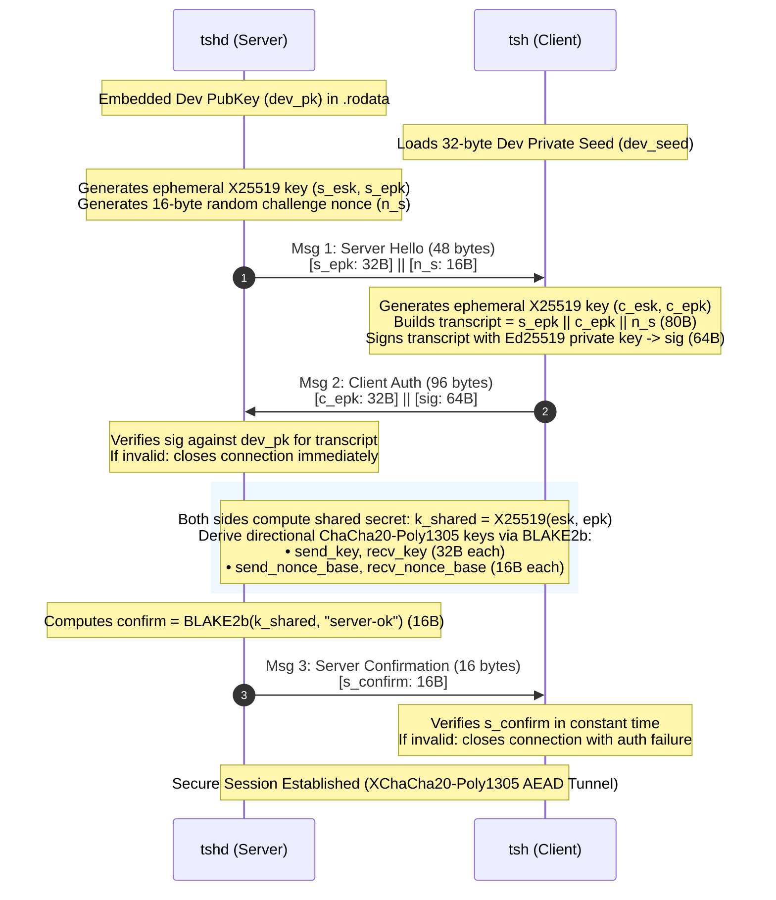

# Tiny SHell (tsh) Packet Encryption Layer (PEL) Handshake

This document describes the cryptographic authentication and key exchange handshake implemented in Tiny SHell's Packet Encryption Layer (`pel.c`, `pel.h`, `tsh_pel.py`).

---

## 1. Cryptographic Primitives

The protocol relies on modern, constant-time primitives provided by Monocypher in C and PyNaCl in Python:

| Function | Primitive | Key Size | Output / Block Size |
|---|---|---|---|
| **Key Exchange (KEX)** | X25519 (ECDH) | 32 bytes | 32 bytes |
| **Authentication** | Ed25519 (Signature) | 32-byte seed / 64-byte secret key | 64-byte signature |
| **Key Derivation (KDF)** | BLAKE2b (Keyed) | 32 bytes | 16 or 32 bytes |
| **Transport Encryption** | XChaCha20-Poly1305 | 32-byte key, 24-byte nonce | 16-byte MAC tag |

---

## 2. Key Architecture & Trust Model

Tiny SHell uses an asymmetric client-authentication model designed for resource-constrained embedded targets:

- **Server (`tshd`)**:
  - Embedded developer public key: `default_dev_pk[32]` in `tsh_pubkey.h` (stored in `.rodata`).
  - Contains **no private keys** and performs no runtime filesystem key lookups.
  - Generated automatically at compile time via `scripts/keygen.py`.
- **Client (`tsh` / `tsh_client.py`)**:
  - Developer private key seed: 32 bytes stored with `0600` permissions (`tsh_key`).
  - Derives the 64-byte Ed25519 secret key and 32-byte public key on startup.

---

## 3. Protocol Handshake Sequence

The handshake consists of 3 messages exchanged over a TCP stream immediately following socket connection:



---

## 4. Message Specifications

### Message 1: Server Hello (`Server -> Client`)

- **Total Length:** 48 bytes
- **Wire Layout:**

```
+-----------------------------------+--------------------+
| Server Ephemeral PubKey (s_epk)   | Server Nonce (n_s) |
| 32 bytes                          | 16 bytes           |
+-----------------------------------+--------------------+
```

1. Server draws 48 bytes of cryptographically secure randomness from `/dev/urandom` (or `getrandom()`):
   - 32 bytes for `s_esk` (ephemeral secret key).
   - 16 bytes for `n_s` (challenge nonce).
2. Server calculates $s\_epk = \text{X25519}(s\_esk, 9)$ (scalar base multiplication).
3. Server transmits `s_epk || n_s`.

*Security Purpose:* Provides the server's ephemeral public key for ECDH and introduces freshness ($n_s$) to bind the client's signature to this specific connection.

---

### Message 2: Client Authentication (`Client -> Server`)

- **Total Length:** 96 bytes
- **Wire Layout:**

```
+-----------------------------------+----------------------------------------------------------------+
| Client Ephemeral PubKey (c_epk)   | Ed25519 Signature (sig)                                        |
| 32 bytes                          | 64 bytes                                                       |
+-----------------------------------+----------------------------------------------------------------+
```

1. Client receives Message 1 and extracts `s_epk` and `n_s`.
2. Client generates its own ephemeral keypair:
   - $c\_esk \leftarrow \text{Random}(32)$
   - $c\_epk = \text{X25519}(c\_esk, 9)$
3. Client constructs the 80-byte handshake transcript:
   $$\text{transcript} = s\_epk \;(32\text{B}) \;||\; c\_epk \;(32\text{B}) \;||\; n\_s \;(16\text{B})$$
4. Client signs the transcript with its long-term Ed25519 private key:
   $$\text{sig} = \text{crypto\_ed25519\_sign}(dev\_sk, \text{transcript})$$
5. Client sends `c_epk || sig`.
6. Client wipes $dev\_sk$ and the temporary seed buffer with `crypto_wipe()`.

*Security Purpose:* Authenticates the client, binds the signature to both ephemeral keys, and prevents replay attacks by signing the server's single-use challenge nonce.

---

### Verification & Key Derivation (Both Endpoints)

1. Server receives Message 2 and extracts `c_epk` and `sig`.
2. Server reconstructs the 80-byte `transcript` and verifies `sig`:
   ```c
   if (crypto_ed25519_check(sig, dev_pk, transcript, 80) != 0) {
       pel_errno = PEL_WRONG_CHALLENGE;
       return PEL_FAILURE;
   }
   ```
   If verification fails, the server terminates the connection without further processing.
3. Both endpoints independently compute the Diffie-Hellman shared secret:
   $$k\_shared = \text{X25519}(esk, epk)$$
4. Both endpoints derive four directional session parameters using keyed BLAKE2b:
   - **Client-to-Server Key (`c2s`):** `BLAKE2b(key=k_shared, data="c2s")` (32 bytes)
   - **Server-to-Client Key (`s2c`):** `BLAKE2b(key=k_shared, data="s2c")` (32 bytes)
   - **Client-to-Server Base Nonce (`nc2s`):** `BLAKE2b(key=k_shared, data="nc2s")` (16 bytes)
   - **Server-to-Client Base Nonce (`ns2c`):** `BLAKE2b(key=k_shared, data="ns2c")` (16 bytes)
5. Ephemeral secret keys ($s\_esk, c\_esk$) are immediately wiped from memory.

---

### Message 3: Server Confirmation (`Server -> Client`)

- **Total Length:** 16 bytes
- **Wire Layout:**

```
+------------------------------------+
| Server Confirmation Token (s_conf) |
| 16 bytes                           |
+------------------------------------+
```

1. Server computes a 16-byte confirmation tag over the shared secret:
   $$s\_conf = \text{BLAKE2b}_{16}(key=k\_shared, data=\text{"server-ok"})$$
2. Server wipes `k_shared` and transmits `s_conf`.
3. Client computes the expected token and compares using `crypto_verify16()` (constant-time):
   ```c
   if (crypto_verify16(s_confirm, expected_confirm) != 0) {
       pel_errno = PEL_WRONG_CHALLENGE;
       return PEL_FAILURE;
   }
   ```
4. Client wipes `k_shared`.

*Security Purpose:* Mutual key confirmation. Proves to the client that the server verified the signature and holds the identical shared secret before the client transmits commands or data.

---

## 5. Post-Handshake Transport Framing

All subsequent traffic is encrypted and authenticated using **XChaCha20-Poly1305 AEAD**:

```
+-------------------+----------------------------+-------------------------------------+
| Length (2 bytes)  | Poly1305 MAC Tag (16 bytes)| Encrypted Ciphertext (Length bytes) |
| Big-Endian uint16 | Authenticator              | XChaCha20 Payload                   |
+-------------------+----------------------------+-------------------------------------+
```

- **Maximum Plaintext Length:** 4,096 bytes (`BUFSIZE`).
- **Nonce Construction:**
  Each packet constructs a 24-byte XChaCha20 nonce from the 16-byte directional base nonce and a 64-bit sequence counter:
  $$\text{nonce} = \text{nonce\_base} \;(16\text{B}) \;||\; \text{seq\_num} \;(8\text{B, big-endian})$$
  The sequence counter starts at `0` upon handshake completion and increments by `1` for each sent packet.
- **Associated Data (AD):**
  The AEAD authenticator binds both the wire length and the sequence counter to prevent framing manipulation:
  $$\text{AD} = \text{Length} \;(2\text{B, big-endian}) \;||\; \text{seq\_num} \;(8\text{B, big-endian})$$

---

## 6. Security Guarantees

1. **Forward Secrecy:** Ephemeral X25519 keys are generated per session and wiped immediately after derivation. Compromising the developer's private signing key does not decrypt past recorded sessions.
2. **Replay Protection:** The server's 16-byte random nonce $n_s$ is signed in Message 2. A recorded client signature cannot be replayed in any other session.
3. **Sequence Integrity:** Monotonically increasing 64-bit sequence numbers in the transport nonce and associated data prevent packet replay, reordering, deletion, and injection.
4. **Key Separation:** Separate symmetric keys and nonces for client-to-server and server-to-client directions prevent reflection attacks.
5. **Zero Private Key Exposure on Server:** The server stores only a 32-byte public key in `.rodata`. Physical capture or memory extraction of `tshd` yields no client credentials.
