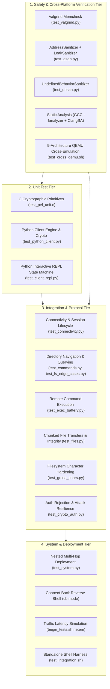

# Test Suite Architecture & Comprehensive Test Catalog

This document details the complete testing harness for `tinyishell`, explaining the purpose, scope, and technical assertions of all unit, integration, system, and sanitizer tests across the codebase.

---

## 1. Test Pyramid & Execution Architecture

The test suite is structured across four distinct testing tiers:

---

## 2. Unit Testing Tier

Unit tests validate isolated components, wire protocols, and parsing logic in memory without reliance on external daemons.

### 2.1 C Cryptographic & Packet Encryption Layer (PEL)
- **Source:** [`test/test_pel_unit.c`](file:///home/sam/Projects/tinyishell/test/test_pel_unit.c)
- **Invoked via:** `make valgrind`, `make asan`, `make ubsan`, `make test_cross_qemu`, or `test_crypto_auth.py::test_pel_c_unit_suite`.
- **Target Components:** [`pel.c`](file:///home/sam/Projects/tinyishell/pel.c), [`monocypher.c`](file:///home/sam/Projects/tinyishell/monocypher.c), [`monocypher-ed25519.c`](file:///home/sam/Projects/tinyishell/monocypher-ed25519.c).
- **Test Cases:**
  1. `test_pel_happy_path`: Establishes socket pairs between child and parent, executes full 3-message Monocypher PEL handshake (Ed25519 signature of transcript, X25519 ECDH key exchange, BLAKE2b key derivation, server confirmation hash), and verifies bidirectional XChaCha20-Poly1305 encrypted packet transmission with 64-bit sequence counters.
  2. `test_pel_mismatched_keys`: Tests that handshake immediately aborts and returns `PEL_FAILURE` if the client signs with an Ed25519 key not matching the server's compiled public key (`default_dev_pk`).
  3. `test_pel_tampered_ciphertext`: Tampers with ciphertext bytes in transit; verifies that Poly1305 MAC tag failure causes `pel_recv_msg` to reject the packet with `PEL_CORRUPTED_DATA`.
  4. `test_pel_tampered_tag`: Corrupts a single byte of the 16-byte Poly1305 authentication tag; verifies rejection.
  5. `test_pel_oversized_packet`: Attempts to send packets exceeding `BUFSIZE` (4096 bytes); verifies `PEL_BAD_MSG_LENGTH` bounds enforcement.

### 2.2 Python Client Engine & Cryptographic Parity
- **Source:** [`test/test_python_client.py`](file:///home/sam/Projects/tinyishell/test/test_python_client.py)
- **Target Components:** [`tsh_pel.py`](file:///home/sam/Projects/tinyishell/tsh_pel.py), [`tsh_client.py`](file:///home/sam/Projects/tinyishell/tsh_client.py).
- **Test Cases:**
  - `test_python_client_raw_key_seed_derivation`: Validates that PyNaCl `SigningKey` generated from raw 32-byte seeds produces matching Ed25519 public keys and signatures bit-for-bit identical to C Monocypher.
  - `test_python_client_auth_failure_wrong_key`: Verifies that a client initialized with an incorrect 32-byte key seed receives exit code 10 (`Authentication failed.`).
  - `test_python_client_auth_failure_missing_key`: Validates error handling and clean exit (code 1) when key file does not exist on disk.

### 2.3 Interactive REPL State Machine
- **Source:** [`test/test_client_repl.py`](file:///home/sam/Projects/tinyishell/test/test_client_repl.py)
- **Target Components:** `TshRepl` class in [`tsh_client.py`](file:///home/sam/Projects/tinyishell/tsh_client.py).
- **Test Cases:**
  - `test_safe_shlex_split`: Validates POSIX quote-aware argument tokenization (handling spaces, quotes, and catching unclosed quotation syntax errors).
  - `test_repl_path_resolution`: Validates local tracking of remote virtual working directory (`resolve_remote_path`), testing relative paths (`.`, `..`), nested paths (`var/tmp`), parent normalization (`/etc/../var/tmp`), and prompt generation (`tsh [host:cwd]$ `).
  - `test_repl_cd_and_pwd`: Tests interactive navigation commands `cd` and `pwd`, confirming that changing into non-existent directories is rejected via remote existence checks.
  - `test_repl_onecmd_flag`: Tests single-shot execution via `tsh_client.py -c "<command>"`.
  - `test_repl_piped_interactive_session`: Tests streaming multi-command scripts through `stdin` pipeline (`pwd\ncd /var/tmp\npwd\nexit\n`).
  - `test_repl_local_dirs`: Tests `lcd` and `lpwd` local filesystem navigation while preserving remote state.
  - `test_repl_license_and_version`: Validates version and licensing string output (`-v`).

---

## 3. Integration Testing Tier

Integration tests spin up a live, backgrounded `tshd` instance and exercise transactions over actual network sockets.

### 3.1 Connectivity & Authentication Hardening
- **Source:** [`test/test_connectivity.py`](file:///home/sam/Projects/tinyishell/test/test_connectivity.py), [`test/test_crypto_auth.py`](file:///home/sam/Projects/tinyishell/test/test_crypto_auth.py)
- **Target Components:** Socket bind/accept lifecycle in [`tshd.c`](file:///home/sam/Projects/tinyishell/tshd.c) and [`pel_server_init`](file:///home/sam/Projects/tinyishell/pel.c).
- **Test Cases:**
  - `test_connectivity`: Basic smoke test validating loopback TCP connection, handshake, and root directory listing.
  - `test_auth_failure_wrong_key`: Tests connection rejection when authenticating with mismatched 32-byte key.
  - `test_auth_failure_missing_key_file`: Validates POSIX error message and exit code when key file is absent.
  - `test_auth_failure_short_key_file`: Tests rejection when key file is smaller than 32 bytes (`Key file must be at least 32 bytes`).
  - `test_auth_recovery_after_failed_attempts`: Fires 5 consecutive invalid authentication attempts in rapid succession, verifying that `tshd` does not lock up, crash, or enter a zombie state, and that subsequent legitimate authentications succeed instantly.

### 3.2 Directory Operations (`ls`)
- **Source:** [`test/test_commands.py`](file:///home/sam/Projects/tinyishell/test/test_commands.py), [`test/test_ls_edge_cases.py`](file:///home/sam/Projects/tinyishell/test/test_ls_edge_cases.py)
- **Target Components:** Direct library calls in `tshd_ls_dir()` ([`tshd.c`](file:///home/sam/Projects/tinyishell/tshd.c)).
- **What is Tested:**
  - Direct syscall directory traversal (`SYS_getdents64`) with 8-byte buffer alignment to prevent `SIGBUS` on RISC architectures.
  - Listing root (`/`), system directories (`/home`, `/var/tmp`), empty directories, and non-existent paths.
  - Handling deeply nested directories (`a/b/c/d/e/f`) and directories with unusual names (`has spaces`, special characters).
  - Validation of output format (`<mode> <uid> <gid> <size> <name>`).

### 3.3 Remote Command Execution (`exec`)
- **Source:** [`test/test_commands.py`](file:///home/sam/Projects/tinyishell/test/test_commands.py), [`test/test_exec_battery.py`](file:///home/sam/Projects/tinyishell/test/test_exec_battery.py)
- **Target Components:** `tshd_execv()` in [`tshd.c`](file:///home/sam/Projects/tinyishell/tshd.c).
- **What is Tested:**
  - Remote execution via `fork` and `execl("/bin/sh", "sh", "-c", cmd, NULL)`.
  - Proper propagation of process exit codes across the encrypted wire:
    - `/usr/bin/true` -> Exit code 0
    - `/usr/bin/false` -> Exit code 1
    - `/usr/bin/sleep 0.1` -> Clean termination
  - Side-effect verification: Executing `/usr/bin/touch /var/tmp/file` followed by `ls /var/tmp` to confirm filesystem mutations.

### 3.4 File Transfer Lifecycle & Data Integrity (`put` / `get`)
- **Source:** [`test/test_files.py`](file:///home/sam/Projects/tinyishell/test/test_files.py), [`test/test_python_client.py`](file:///home/sam/Projects/tinyishell/test/test_python_client.py)
- **Target Components:** `tshd_put_file()`, `tshd_get_file()` ([`tshd.c`](file:///home/sam/Projects/tinyishell/tshd.c)).
- **What is Tested:**
  - **Round-Trip Integrity:** Writing random data locally -> `put` to `/var/tmp` -> `get` back to an isolated directory -> comparing SHA256 hashes.
  - **Boundary Chunking:** Parametric sweep across file sizes: `0 KB`, `1 KB`, `16 KB`, `64 KB`, `128 KB`, `256 KB`, `512 KB`, and `1024 KB (1 MB)`.
  - Verifies multi-packet streaming across the 4096-byte `BUFSIZE` boundary without framing errors, dropped buffers, or corruption.

### 3.5 Character & Path Hardening
- **Source:** [`test/test_gross_chars.py`](file:///home/sam/Projects/tinyishell/test/test_gross_chars.py)
- **Target Components:** File path construction and syscall handling.
- **What is Tested:**
  - Uploading, listing, and downloading files with problematic POSIX characters:
    - Symbols: `gross_!@#$%^&()_+=-[]{};'", .txt`
    - Whitespace: `name with spaces`
    - Shell Metacharacters: `shell_meta_;&|<>`
    - Quotes: `quotes_"'"`
    - Backslashes: `backslashes_\\`
    - Dots: `dots_.._and_..._dots`
    - Tabs: `tsh_is_nasty_\t_tab`
    - Newlines: `newline_\n_char`
  - Verifies that `tshd` and `tsh_client.py` do not suffer from command injection or path parsing truncation when handling abnormal paths.

---

## 4. System & Deployment Tier

System tests evaluate end-to-end operational scenarios, multi-daemon topologies, and physical network emulation.

### 4.1 Nested Connect-Back Multi-Hop Deployment
- **Source:** [`test/test_system.py`](file:///home/sam/Projects/tinyishell/test/test_system.py)
- **What is Tested:**
  1. Compiles a Primary `tshd` (listening on port 1234) and a Secondary Connect-Back daemon `tshd_cb` (configured with `CB_MODE=1`, `CB_HOST=127.0.0.1`, port 5555).
  2. Starts Primary daemon.
  3. Uses `tsh_client.py` to `put` the secondary daemon binary (`tshd_cb`) into `/tmp` via the primary tunnel.
  4. Executes `chmod +x` and starts `tshd_cb` remotely via primary `exec`.
  5. Operator workstation listens in connect-back mode (`./tsh -p 5555 cb ls /`).
  6. Connect-back reverse shell connects inbound from `tshd_cb` to the operator, completes the reverse PEL handshake, and executes remote commands.
  7. Verifies multi-daemon process tree and cleans up all background processes.

### 4.2 Traffic Latency & Static musl Validation
- **Source:** [`begin_tests.sh`](file:///home/sam/Projects/tinyishell/begin_tests.sh)
- **What is Tested:**
  - Automatically builds `linux_musl` (statically linked musl libc binaries with zero dynamic dependencies).
  - Can inject artificial 2000ms (2s) latency on the loopback interface (`tc qdisc add dev lo root netem delay 2000ms`) to verify that the PEL protocol, socket timeouts, and chunking behave predictably over high-latency satellite or low-bandwidth IoT links.

### 4.3 Standalone Integration Script
- **Source:** [`test_integration.sh`](file:///home/sam/Projects/tinyishell/test_integration.sh)
- **What is Tested:**
  - Non-pytest bash validation script verifying clean builds, automated Ed25519 key generation, daemon backgrounding, single-shot `ls`, `put`, `get`, diff comparison, remote `exec`, and clean process termination.

---

## 5. Memory Safety, Sanitizers & Cross-Platform Tier

Ensures that C server code is resilient against memory corruption, undefined behavior, and foreign architecture endianness flaws.

### 5.1 AddressSanitizer & LeakSanitizer
- **Source:** [`test/test_asan.py`](file:///home/sam/Projects/tinyishell/test/test_asan.py), `make asan`
- **What is Tested:**
  - Builds `tshd` with `-fsanitize=address -g -O1 -fno-omit-frame-pointer`.
  - Executes C unit tests under `ASAN_OPTIONS="detect_leaks=1:abort_on_error=1"`.
  - Executes live client transactions (`ls`, `put`, `get`, `exec`) against `tshd_asan`.
  - Asserts zero out-of-bounds reads/writes, zero use-after-free conditions, and zero heap memory leaks.

### 5.2 Valgrind Memcheck
- **Source:** [`test/test_valgrind.py`](file:///home/sam/Projects/tinyishell/test/test_valgrind.py), `make valgrind`
- **What is Tested:**
  - Compiles unstripped debug binaries (`-O1 -g -fno-inline`).
  - Runs `valgrind --leak-check=full --show-leak-kinds=all --error-exitcode=1` on both `test_pel_unit` and the backgrounded `tshd` daemon during full transaction cycles.
  - Parses Valgrind log files across parent and forked child processes, asserting `0 errors from 0 contexts` and `All heap blocks were freed -- no leaks are possible`.

### 5.3 UndefinedBehaviorSanitizer
- **Source:** [`test/test_ubsan.py`](file:///home/sam/Projects/tinyishell/test/test_ubsan.py), `make ubsan`
- **What is Tested:**
  - Compiles with `-fsanitize=undefined -g -O1`.
  - Detects integer overflows, unaligned memory accesses, invalid bit shifts, or type casting violations during cryptographic operations and directory parsing.

### 5.4 Static Analysis
- **Command:** `make analyze`
- **What is Tested:**
  - GCC Static Analyzer (`-fanalyzer`) on `pel.c` and `tshd.c`.
  - Clang Static Analyzer (`clangsa` via `CodeChecker`) analyzing compilation databases for null pointer dereferences, resource leaks, and dead code.

### 5.5 9-Architecture QEMU Cross-Emulation Matrix
- **Source:** [`scripts/test_cross_qemu.sh`](file:///home/sam/Projects/tinyishell/scripts/test_cross_qemu.sh), `make test_cross_qemu`
- **What is Tested:**
  - Compiles `test_pel_unit` using 9 distinct musl cross-toolchains:
    1. **ARM32** (`arm-linux-musleabi`) - Little-Endian 32-bit
    2. **ARM64** (`aarch64-linux-musl`) - Little-Endian 64-bit
    3. **MIPS32** (`mips-linux-musl`) - **Big-Endian 32-bit**
    4. **MIPSEL32** (`mipsel-linux-musl`) - Little-Endian 32-bit
    5. **RISC-V 64** (`riscv64-linux-musl`) - Little-Endian 64-bit
    6. **RISC-V 32** (`riscv32-linux-musl`) - Little-Endian 32-bit
    7. **PowerPC 32** (`powerpc-linux-musl`) - **Big-Endian 32-bit**
    8. **MIPS64** (`mips64-linux-musl`) - **Big-Endian 64-bit**
    9. **MIPS64EL** (`mips64el-linux-musl`) - Little-Endian 64-bit
  - Executes each binary inside QEMU user-space emulators (`qemu-arm`, `qemu-aarch64`, `qemu-mips`, `qemu-mipsel`, `qemu-riscv64`, `qemu-riscv32`, `qemu-ppc`, `qemu-mips64`, `qemu-mips64el`).
  - Verifies that Monocypher, 64-bit sequence counter endian swaps, and packet framing operate cleanly across both Big-Endian and Little-Endian architectures.

---

## 6. Test Suite Matrix Summary

| Test Domain | Primary Test Files | Execution Method | Total Scenarios / Assertions |
| :--- | :--- | :--- | :--- |
| **C Unit Tests** | `test/test_pel_unit.c` | Native & 9 QEMU Targets | 5 core crypto/framing unit tests |
| **Python Unit & REPL** | `test/test_client_repl.py`, `test_python_client.py` | `pytest` | 14 test cases covering REPL state & crypto |
| **Integration: Core** | `test/test_connectivity.py`, `test_commands.py` | `pytest` | Smoke connectivity, root & home ls, exec verification |
| **Integration: Exec Battery** | `test/test_exec_battery.py` | `pytest` | 6 test cases (exit codes 0, 1, touch/rm side effects) |
| **Integration: File Transfers** | `test/test_files.py` | `pytest` | 9 test cases (0 KB to 1 MB size sweep + SHA256 hashes) |
| **Integration: Resilience** | `test/test_gross_chars.py`, `test_ls_edge_cases.py` | `pytest` | 10 test cases (nasty characters, deep directory trees) |
| **Integration: Security** | `test/test_crypto_auth.py` | `pytest` | 5 test cases (tampering, wrong keys, short keys, flood recovery) |
| **System Deployment** | `test/test_system.py`, `test_integration.sh` | `pytest` / Bash | Multi-daemon nested deployment & reverse shell |
| **Sanitizers & Memory Safety** | `test/test_asan.py`, `test_valgrind.py`, `test_ubsan.py` | `make asan/valgrind/ubsan` | 6 pytest cases + full heap/leak/UB assertions on daemon |
| **Cross-Platform QEMU** | `scripts/test_cross_qemu.sh` | `make test_cross_qemu` | 9 foreign architecture target runs |
